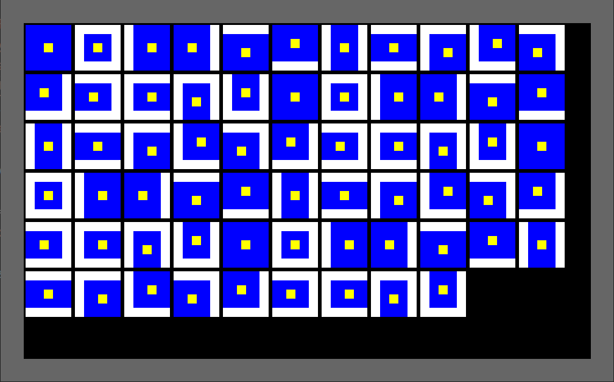

# bevy_ui_borders
[](https://crates.io/crates/bevy_ui_borders)
[](https://github.com/ickshonpe/bevy_ui_borders)
[](https://crates.io/crates/bevy_ui_borders)

## Draw borders around Bevy UI Nodes



* Version 0.2 supports Bevy 0.10, 0.1 supports Bevy 0.9.

* Same implementation as this borders PR: https://github.com/bevyengine/bevy/pull/7795

* No support for border styles due to the limitations of the current Bevy UI renderer.

#
## Usage

Add the dependency to your bevy project:

```
cargo add bevy_ui_borders
```

To display a bordered UI node:
* Add the `BordersPlugin` plugin to your app.
* Spawn an entity with a `BorderBundle` and a `NodeBundle` where the `border` field of its `Style` component is set to a non-zero thickness.

## Example

To draw a white UI node with a red border:

```rust
use bevy::prelude::*;
use bevy_ui_borders::*;

fn spawn_example(mut commands: Commands) {
    commands.spawn(Camera2dBundle::default());
    commands.spawn((
        NodeBundle {
            style: Style {
                size: Size::new(Val::Px(100.), Val::Px(100.)),
                margin: UiRect::all(Val::Px(100.)),
                border: UiRect::all(Val::Px(10.)),
                ..Default::default()
            },
            background_color: Color::WHITE.into(),
            ..Default::default()
        },
        BorderBundle::new(Color::RED),
    ));       
}

fn main() {
    App::new()
        .add_plugins(DefaultPlugins)
        .add_plugin(BordersPlugin)
        .add_startup_system(spawn_example)
        .run();
}
```

#
## Examples

```
cargo --run --example minimal
cargo --run --example tiles
cargo --run --example outlines
```